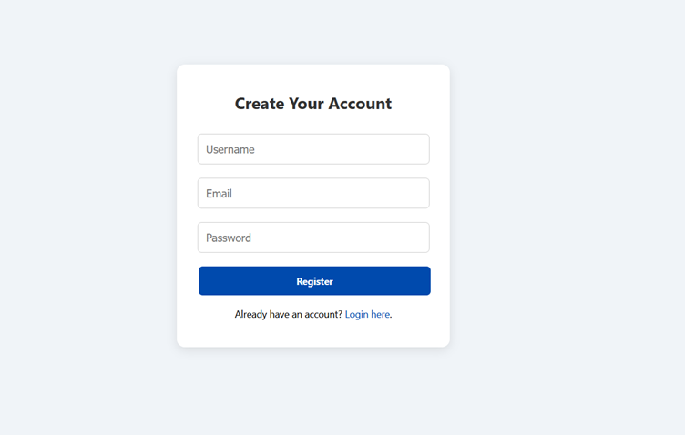
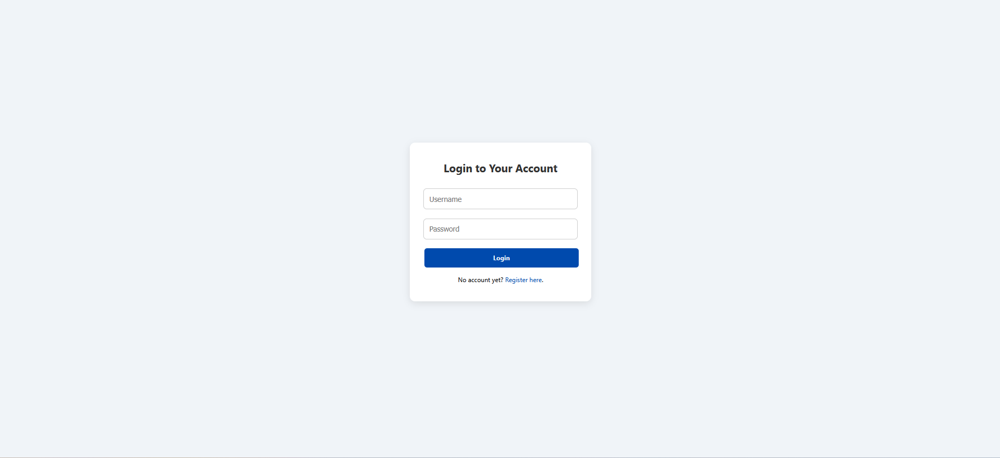
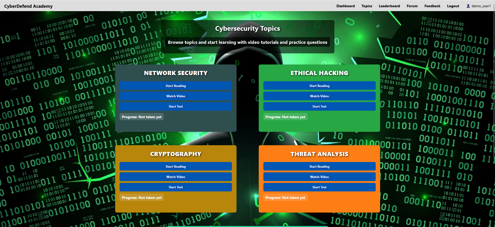
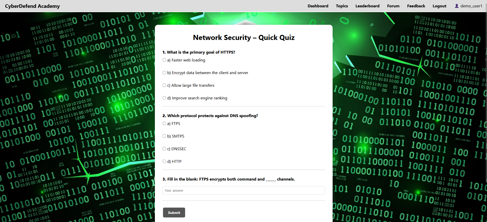
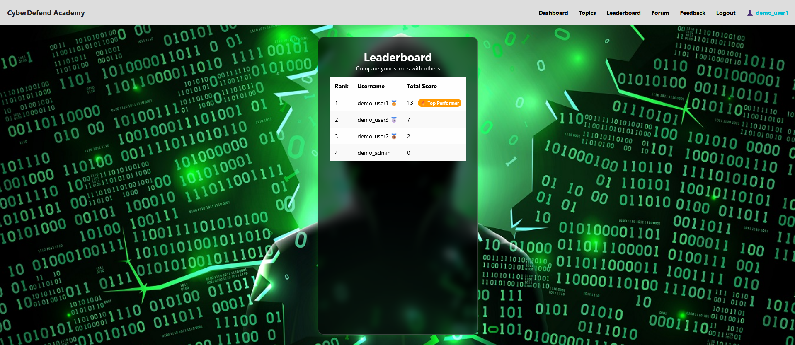

# CyberDefend Academy

A database-driven cybersecurity learning platform built as my university Computing Project. Users can learn core cybersecurity topics, complete quizzes and topic tests, and track progress via a dashboard and leaderboard. An admin interface supports content management (CRUD).

## Key Features
- User authentication (register/login/logout) with session-based access control
- Topic learning pages with embedded video content
- Per-topic **Quick Quiz** (mixed MCQ + fill-in)
- Per-topic **Test** (10 questions)
- Automatic scoring and saving results to the database
- User dashboard showing progress per topic (Quiz, Test, Total)
- Leaderboard ranking users by total score
- Admin dashboard for content management (Insert/Update/Delete/View)

- ## Security Controls (Implemented)
- Used prepared statements for database queries to reduce SQL injection risk.
- Enforced session-based access control for authenticated pages.
- Implemented role-based access control (admin vs user) for the admin dashboard.
- Applied server-side validation for key user inputs (registration/login and scoring endpoints).
- Enabled a Content Security Policy (CSP) to restrict script execution to same-origin resources.

## Tech Stack
- PHP
- MySQL (phpMyAdmin)
- HTML/CSS (global stylesheet)
- JavaScript (client-side quiz logic; CSP-safe external scripts)

## How to Run (Local)
1. Install XAMPP.
2. Copy the `CyberDefend` folder into `C:\xampp\htdocs\`
3. Start Apache and MySQL in XAMPP.
4. Create a MySQL database called `cyberdefend`.
5. Import `database/schema.sql` into the `cyberdefend` database using phpMyAdmin.
6. Open `http://localhost/CyberDefend/` in your browser.

## Screenshots (Evidence)

### User Journey

### Learning Topics

### Quizzes and Tests

### Progress Tracking and Leaderboard

### Admin Interface

### Database Proof (Persistence)

## Notes
- All usernames shown are dummy demo accounts created for demonstration purposes.
- Sensitive configuration values (e.g., database credentials) are not included in the public repository.
